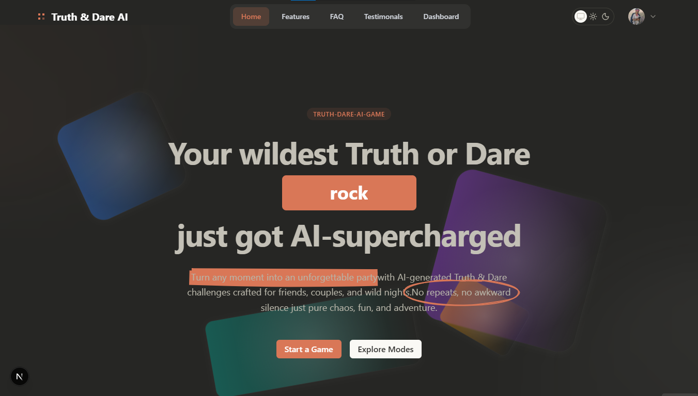

# Truth or Dare – AI Powered Game

## 📸 Preview



## Overview

This project is a fully interactive AI-generated Truth & Dare game.
Users can create custom games, set difficulty, theme, and players, and then play a unique session powered by AI-generated questions.
## ✨ Features

- **🎭 AI-Generated Truths & Dares.
- **🏠 Dashboard to manage all games.
- **⚙️ Game customization (category, difficulty, environment, etc.).
- **🔐 Authentication with BetterAuth.
- **💅 Clean, modern UI with Tailwind & shadcn/ui.
- **🔐 Authentication with BetterAuth.
- **🚀 Optimized for performance & accessibility.

## 🛠️ Tech Stack

- **Frontend Framework**: Next.js 16
- **UI Library**: React 19
- **Type Safety**: TypeScript
- **Styling**: Tailwind CSS,shadcn/ui
- **Animations**: Framer Motion
- **Database and ORM**: PostgreSQL,Prisma ORM,Neon DB
- **Authentication**: BetterAuth
- **AI SDK**: Vercel AI SDK
- **Code Quality**: ESLint & Prettier

## 📁 Project Structure

```
/
├── app
│   ├── (auth)
│   │   ├── _components/
│   │   │   └── authForm.tsx
│   │   └── login/
│   │       └── page.tsx
│   ├── api
│   │   ├── auth/[...all]/route.ts
│   │   ├── games/
│   │   │   ├── [id]/route.ts
│   │   │   └── route.ts
│   │   └── generate-questions/route.ts
│   ├── dashboard/
│   │   ├── _components/
│   │   │   ├── CreateGameDialog.tsx
│   │   │   ├── DeleteGameDialog.tsx
│   │   │   └── userDropdown.tsx
│   │   └── page.tsx
│   ├── play/[id]/page.tsx
│   ├── layout.tsx
│   └── page.tsx
│
├── components/
│   ├── fancy/
│   ├── ui/
│   ├── hero.tsx
│   ├── cta.tsx
│   ├── faq.tsx
│   ├── testimonials.tsx
│   ├── features.tsx
│   ├── feature-section.tsx
│   ├── navbar.tsx
│   ├── footer-section.tsx
│   └── logo_marquee.tsx
│
├── lib/
│   ├── generated/
│   ├── auth.ts
│   ├── auth-client.ts
│   ├── prisma.ts
│   └── utils.ts
│
├── prisma/
│   ├── migrations/
│   └── schema.prisma
│
├── public/
│   ├── images/
│   │   ├── screenshotdash.png
│   │   ├── screenshootcreate.png
│   │   ├── screenshotplay.png
│   │   └── more…
│   └── vercel.svg
│
├── hooks/
├── .gitignore
├── next.config.ts
├── package.json
├── components.json
├── tailwind.config.ts
└── README.md
```


## 🚀 Getting Started

### Prerequisites

- Node.js 18+ installed
- pnpm or npm package manager
- Git

### Installation Steps

1. Clone the repository:

   ```sh
   https://github.com/Leulc21/The_Portfolio.git
   ```

2. Navigate to the project directory:

   ```sh
   cd The_Portfolio
   ```

3. Install the dependencies:

   ```sh
   pnpm install
   ```

4. Start the development server:

   ```sh
   pnpm dev
   ```

5. Open [http://localhost:3000](http://localhost:3000) in your browser

## 📝 License

This project is licensed under the MIT License - see the [LICENSE](LICENSE) file for details.

## 📞 Contact

For questions or feedback, reach out through:

- Email: leulchanie576@gmail.com
- Instagram: [@leulc21_type](https://www.instagram.com/leulch21?igsh=ejQ3OXRrMjE0NWxx)
- LinkedIn: [leulc1](https://www.linkedin.com/in/leul-chanie-7b10ba260?utm_source=share&utm_campaign=share_via&utm_content=profile&utm_medium=android_app)

---

Built with ❤️ by [Leul Chanie]
